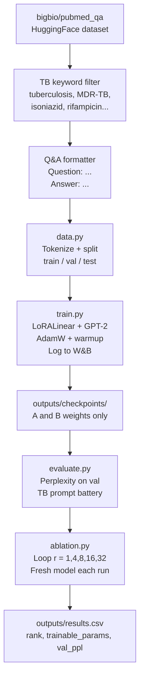
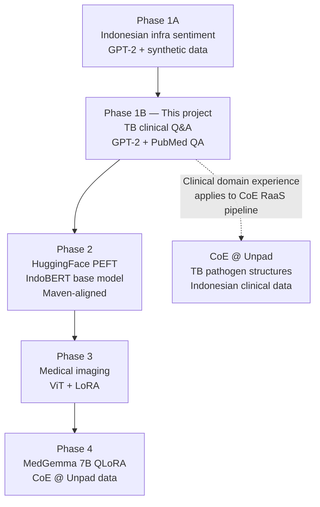

# Product Requirements Document
## LoRA Phase 1B — TB Clinical Q&A

**Project:** `lora-phase1b`
**Owner:** Arie Setyawan, PT Galenic Systems Indonesia
**Status:** Not Started
**Last updated:** 2026-04-22

---

## 1. Purpose

This project is a **learning artifact** — the direct sequel to `lora-phase1` (Indonesian infrastructure sentiment). The goal is to apply the same LoRA fundamentals to a different task type: open-ended Q&A generation on tuberculosis clinical literature.

The change in task type — from sentiment completion to clinical Q&A — changes the data format, evaluation strategy, and what "success" looks like, while the underlying LoRA implementation remains identical.

The concrete outputs are:
1. A working LoRA fine-tune of GPT-2 on TB clinical Q&A data from PubMed
2. A rank ablation experiment with documented results
3. A side-by-side comparison of Phase 1A and 1B findings

---

## 2. Scope

### In scope
- Reuse of `LoRALinear` and `apply_lora_to_gpt2` from Phase 1A (no reimplementation)
- New `data.py`: PubMed QA loader, TB keyword filter, Q&A formatter
- New `prompts.py`: TB clinical Q&A battery
- Training, evaluation, and rank ablation using the same loop as Phase 1A
- W&B logging and results CSV
- Cross-phase comparison of rank vs PPL results

### Out of scope
- Any clinical validation or medical accuracy assessment
- Production deployment
- PEFT library (Phase 2)
- Models larger than GPT-2
- Question token masking (Phase 2 concern)

---

## 3. Success Criteria

| Layer | Check | Pass condition |
|---|---|---|
| **L1 — Sanity** | Trainable parameter % | 0.1–2% of total; W frozen; A and B have gradients |
| **L2 — Signal** | Loss curve shape | Val loss falls and tracks train loss |
| **L3 — Perplexity** | In-domain PPL drop | ≥ 15% drop from baseline on TB val set |
| **L4 — Qualitative** | Prompt battery | TB prompts produce more specific clinical completions vs base GPT-2 |

---

## 4. Architecture

### Data flow



### Module responsibilities

| File | Source | Changes from Phase 1A |
|---|---|---|
| `src/lora.py` | Copy from Phase 1A | None |
| `src/data.py` | New | PubMed QA loader, TB filter, Q&A format |
| `src/train.py` | Copy from Phase 1A | None |
| `src/evaluate.py` | Copy from Phase 1A | None |
| `src/ablation.py` | Copy from Phase 1A | Update `data_path` and `max_length` only |
| `prompts.py` | New | TB clinical Q&A battery |
| `run_training.py` | Copy from Phase 1A | Update config block only |
| `requirements.txt` | Copy from Phase 1A | None |

---

## 5. Module Specifications

### 5.1 `data.py` (new)

Loads `bigbio/pubmed_qa`, filters for TB-relevant records, formats as Q&A pairs, tokenizes, and returns DataLoaders.

**TB filter keywords:**
```python
TB_KEYWORDS = [
    "tuberculosis", " TB ", "Mycobacterium tuberculosis",
    "MDR-TB", "XDR-TB", "isoniazid", "rifampicin",
    "rifampin", "pyrazinamide", "ethambutol", "pulmonary TB",
    "latent TB", "BCG"
]
```

Filter logic: include any record where at least one keyword appears in the question OR the long answer (case-insensitive).

**Q&A format per example:**
```
Question: {question}
Answer: {long_answer}
```

This formatted string is the full training input. No label tokens. Labels == input_ids (causal LM).

**Key parameters:**
- `dataset_name`: `"bigbio/pubmed_qa"`
- `max_length`: `512`
- `val_split`: `0.2`
- `test_n`: `100`

---

### 5.2 Modules copied from Phase 1A without changes

**`lora.py`** — `LoRALinear`, `apply_lora_to_gpt2`, `print_trainable_params`. No changes.

**`train.py`** — Training loop, AdamW, warmup scheduler, W&B logging, adapter checkpoint saving. No changes.

**`evaluate.py`** — `compute_perplexity`, `run_prompt_battery`. No changes.

---

### 5.3 `ablation.py` (copied, two-line change)

Update only:
```python
train_loader, val_loader, _ = get_dataloaders(
    dataset_name="bigbio/pubmed_qa",
    max_length=512,
)
```

---

### 5.4 `run_training.py` config block

```python
RANK = 8
ALPHA = 8
EPOCHS = 3
LR = 2e-4
BATCH_SIZE = 4          # reduced from 8 — 512-token sequences are heavier
WANDB_PROJECT = "lora-tb-phase1b"
CHECKPOINT_DIR = "outputs/checkpoints"
```

---

## 6. Dataset

**Primary:** `bigbio/pubmed_qa` — PubMed abstracts formatted as Q&A pairs. Each record has:
- `question`: a clinical research question
- `long_answer`: the abstract or relevant passage as the answer
- `final_decision`: yes / no / maybe (ignored for causal LM training)

**Loading:**
```python
from datasets import load_dataset
dataset = load_dataset("bigbio/pubmed_qa", "pubmed_qa_labeled_fold0_bigbio_qa", trust_remote_code=True)
```

**Expected TB yield:** 500–2,000 records after filtering — sufficient for Phase 1B.

**Alternative:** `lavita/medical-qa-datasets` — broader medical Q&A; filter similarly for TB keywords.

**Split:**
- 80% train
- 20% validation
- 100 examples held out as test set (never seen during training)

---

## 7. Hyperparameters

| Parameter | Phase 1A value | Phase 1B value | Reason for change |
|---|---|---|---|
| Learning rate | `2e-4` | `2e-4` | No change |
| Epochs | 3–5 | 3–5 | No change |
| Batch size | 8 | 4 | 512-token sequences use more memory |
| Max sequence length | 128 | 512 | Clinical answers are much longer |
| Warmup steps | 10% of total | 10% of total | No change |
| LoRA alpha | `= r` | `= r` | No change |
| Rank values (ablation) | 1, 4, 8, 16, 32 | 1, 4, 8, 16, 32 | No change |

---

## 8. Hardware

Same as Phase 1A. The batch size reduction to 4 keeps memory within the same budget.

| Option | Suitable | Notes |
|---|---|---|
| Local Mac (MPS) | ✅ | Slower per run due to longer sequences |
| Google Colab (T4) | ✅ | Fine for Phase 1B |
| Vast.ai RTX 3060 | ✅ | Recommended for full ablation |

---

## 9. Deliverables

| Deliverable | Location | Status |
|---|---|---|
| TB-filtered dataset | Auto-cached by HuggingFace | ⬜ Not started |
| `data.py` | `src/data.py` | ⬜ Not started |
| `prompts.py` | `prompts.py` | ⬜ Not started |
| Training run (r=8) | W&B `lora-tb-phase1b` | ⬜ Not started |
| Rank ablation CSV | `outputs/results.csv` | ⬜ Not started |
| W&B charts | W&B project `lora-tb-phase1b` | ⬜ Not started |
| Phase 1A vs 1B comparison | Written addendum or standalone post | ⬜ Not started |

---

## 10. Phase Exit Criteria

- [ ] TB-filtered dataset prepared and verified (≥ 500 records)
- [ ] `LoRALinear` reused from Phase 1A — trainable params confirmed < 2%
- [ ] At least one complete training run to convergence
- [ ] Val PPL drops ≥ 15% from baseline on TB val set
- [ ] Rank ablation across ≥ 4 rank values completed
- [ ] Results CSV and W&B chart produced
- [ ] Side-by-side prompt battery output (base GPT-2 vs fine-tuned) documented for 5 prompts
- [ ] Brief comparison write-up against Phase 1A findings completed

---

## 11. Connection to Broader Galenic Work



---

*Reference: `lora-phase1b.md` for the full learning guide.*
*Reference: `lora-phase1.md` and `lora-project/` for Phase 1A.*
