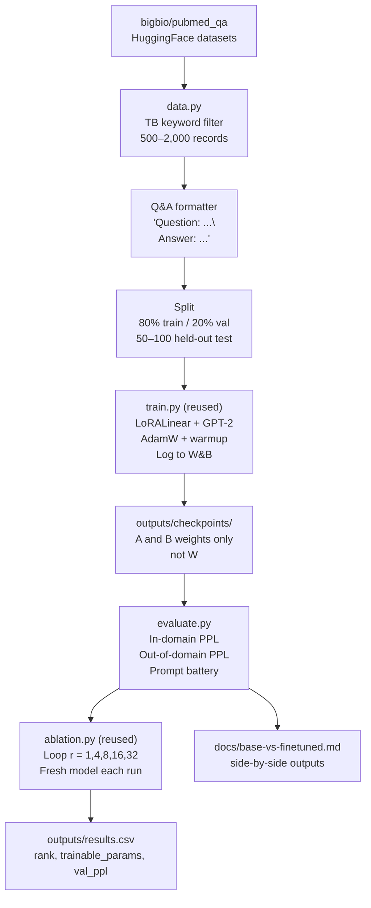
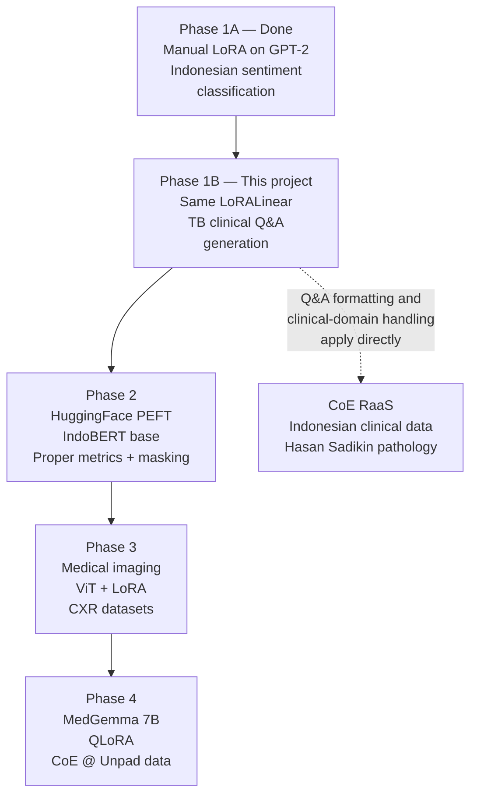

# Product Requirements Document
## LoRA Phase 1B — TB Clinical Q&A

**Project:** `lora-project-1b`
**Owner:** Arie M. Prasetyo, PT Galenic Systems Indonesia
**Status:** Not started
**Last updated:** 2026-05-06

---

## 1. Purpose

This project is a **learning artifact**, not a production system. It is the second iteration of the manual LoRA learning track. Phase 1A proved the LoRA mechanics on a short-text classification task (Indonesian infrastructure sentiment, IndoBERT/GPT-2). Phase 1B applies the **same `LoRALinear` implementation** to a different task type — open-ended Q&A generation on real tuberculosis clinical literature — to observe how task type changes training dynamics, evaluation, and rank requirements.

The concrete output is:
1. A working LoRA fine-tune of GPT-2 on TB clinical Q&A pairs from PubMed
2. A rank ablation experiment with documented results
3. A side-by-side comparison of base GPT-2 vs fine-tuned output on a TB prompt battery
4. A short addendum / blog post comparing Phase 1A and Phase 1B findings

Phase 1B is the bridge between the first manual implementation and Phase 2 (HuggingFace PEFT, IndoBERT, real metrics).

---

## 2. Scope

### In scope
- **Reuse** the manual `LoRALinear` from Phase 1A (no PEFT library, no reimplementation)
- Apply LoRA to GPT-2's `c_attn` attention layers (same `apply_lora_to_gpt2`)
- Build a TB-filtered Q&A dataset from `bigbio/pubmed_qa` (HuggingFace `datasets`)
- Causal-LM training over the full `Question: ... Answer: ...` string
- Evaluation via in-domain perplexity, out-of-domain perplexity, and a TB prompt battery
- Rank ablation experiment: `r = 1, 4, 8, 16, 32`
- Logging to Weights & Biases
- A CSV of ablation results and a side-by-side base-vs-fine-tuned output document

### Out of scope
- Production deployment of any kind
- Serving the model via API or UI
- PEFT library (saved for Phase 2)
- Models larger than GPT-2 (saved for Phase 3–4)
- Masking question tokens during loss computation (introduced in Phase 2)
- Any clinical claims — this model is **not** safe for clinical use

---

## 3. Success criteria

All four layers must be satisfied, in order. A failure at any layer invalidates the layers below it.

| Layer | Check | Pass condition |
|---|---|---|
| **L1 — Sanity** | Trainable parameter % | 0.1–2% of total; W frozen; A and B have gradients |
| **L2 — Signal** | Loss curve shape | Val loss falls and tracks train loss; no flat lines |
| **L3 — Perplexity** | In-domain TB PPL drops ≥ 15% from baseline; out-of-domain PPL roughly stable | No collapse on general English |
| **L4 — Qualitative** | TB prompt battery shows specific terminology (drug names, regimen durations) | Not generic filler |

### Q&A-specific check

Run the same TB prompt through **base GPT-2** and the **fine-tuned model** side by side. The base model will hallucinate or give generic answers. The fine-tuned model should produce text that sounds like it has read PubMed — more specific drug names, treatment durations, diagnostic criteria.

---

## 4. Architecture

### Data flow



### Module responsibilities

| File | Status | Responsibility |
|---|---|---|
| `src/lora.py` | **Reused from 1A** | `LoRALinear`, `apply_lora_to_gpt2`, `print_trainable_params` — no changes |
| `src/data.py` | **New** | Pull `bigbio/pubmed_qa`, filter for TB, format as Q&A, return train/val/test `DataLoader`s |
| `src/train.py` | **Reused from 1A** | Training loop; AdamW; linear warmup; W&B logging |
| `src/evaluate.py` | **Modified** | `compute_perplexity`, `run_prompt_battery`; replaces accuracy from 1A |
| `src/ablation.py` | **Reused from 1A** | Loop over rank values; only `data_path` config changes |
| `src/config.py` | **Modified** | Update `MODEL_NAME` (still gpt2), W&B project, paths, max_length, defaults |
| `prompts.py` | **New** | TB clinical Q&A prompt battery (5–10 prompts) |
| `run_training.py` | **Modified** | Same structure as 1A; switch to `GPT2LMHeadModel` (causal LM, not classification) |
| `requirements.txt` | **Modified** | Add `datasets>=2.18.0` (Phase 1A loaded local JSON) |

---

## 5. Module specifications

### 5.1 `LoRALinear` (`src/lora.py`) — reused

Copy the file verbatim from Phase 1A. Verify on first run that `print_trainable_params(model)` shows ~0.3–0.5% for `r=8` after `apply_lora_to_gpt2`. No code changes required.

### 5.2 `data.py` — new

Loads `bigbio/pubmed_qa` via the HuggingFace `datasets` library, filters for TB-relevant records, formats each record as a single causal-LM training string, and returns `DataLoader` objects.

**Key details:**
- Source: `bigbio/pubmed_qa` (config: `pubmed_qa_labeled_fold0_source` or `pubmed_qa_artificial_source` — pick the one that loads cleanly; document the choice)
- Filter: keep records where any TB keyword appears (case-insensitive) in `question` or `long_answer`. Keywords: `tuberculosis`, ` TB `, `Mycobacterium`, `MDR-TB`, `XDR-TB`, `isoniazid`, `rifampicin`, `pulmonary TB`, `pyrazinamide`, `ethambutol`
- Format: `f"Question: {q}\nAnswer: {a}"` where `a` is the `long_answer` field
- Tokenizer: `GPT2Tokenizer.from_pretrained("gpt2")`, with `pad_token = eos_token`
- `max_length=512` (longer than 1A's 128 — clinical answers are denser)
- Causal LM: `labels = input_ids.clone()` (no question masking — this is Phase 1B simplification)
- Splits: 80% train / 20% val of the filtered set, **then** carve a 50–100 example test split that is never seen during training (used for prompt battery only)
- Cache the filtered dataset to `data/tb_qa.json` on first run so subsequent runs skip the HF download/filter step

**Expected yield:** 500–2,000 TB-relevant records. If yield is below 300, fall back to `lavita/medical-qa-datasets` and re-filter (document this in the run log).

See `docs/reference/dataset_gathering.md` for the operational walkthrough.

### 5.3 `train.py` — reused

Reuse from Phase 1A unchanged. Behavior:
- AdamW optimizer, `lr=2e-4`
- Linear warmup over first 10% of steps
- Log `train/loss` and `val/loss` to W&B each epoch
- `model.eval()` + `torch.no_grad()` during validation
- Save checkpoint after each epoch to `outputs/checkpoints/rank_{r}_epoch_{n}.pt` (saves only A and B state dicts)

The training loop is task-agnostic because the loss is the model's built-in cross-entropy over `labels`. As long as `data.py` returns `input_ids` / `attention_mask` / `labels` for causal LM, no code change is needed.

### 5.4 `evaluate.py` — modified

```python
def compute_perplexity(model, dataloader, device) -> float
def run_prompt_battery(model, tokenizer, prompts, device, max_new_tokens=120) -> list[dict]
```

- `compute_perplexity`: average cross-entropy over the dataloader, exponentiate. Use `model.eval()` + `torch.no_grad()`. Compute separately for in-domain (TB val set) and out-of-domain (a small sample of `wikitext-2-raw-v1` test set, 50 records, to detect catastrophic forgetting)
- `run_prompt_battery`: greedy decoding plus one sampled run per prompt (`do_sample=True`, `temperature=0.7`, `top_p=0.9`). Returns a list of `{"prompt": ..., "greedy": ..., "sampled": ...}`

The Phase 1A `compute_accuracy` and `run_example_predictions` are dropped — this phase is generative.

### 5.5 `ablation.py` — reused

Iterates `r in [1, 4, 8, 16, 32]`. For each rank:
1. Load a fresh base `GPT2LMHeadModel` (do not reuse the previous rank's model — initial weights leak between runs)
2. Apply LoRA with the current rank
3. Run full training (3 epochs)
4. Evaluate val perplexity (in-domain) and out-of-domain perplexity
5. Append a row to `outputs/results.csv`: `rank, trainable_params, val_ppl, ood_ppl`
6. Log each run to W&B with run name `ablation_r{r}`

### 5.6 `prompts.py` — new

A list of 8–10 TB clinical prompts in `Question: ...\nAnswer:` format. Suggested coverage:

- First-line treatment for drug-sensitive TB
- Standard regimen duration
- Definition of MDR-TB and XDR-TB
- Common side effects of isoniazid
- Diagnostic criteria for active vs latent TB
- Role of rifampicin in the continuation phase
- TB in HIV-coinfected patients
- Pediatric TB dosing considerations
- Out-of-domain control prompt (e.g. "Question: What is the capital of France?\nAnswer:") to verify the model has not catastrophically forgotten general knowledge

### 5.7 `run_training.py` — modified

Same skeleton as Phase 1A, with three changes:
1. Replace `GPT2ForSequenceClassification` with `GPT2LMHeadModel`
2. Replace `compute_accuracy` calls with `compute_perplexity`
3. Replace `run_example_predictions` with `run_prompt_battery`

W&B run config updates:
- `domain: "tb_clinical_qa"`
- `task: "causal_lm_qa"`
- Drop `num_labels` (not applicable)

---

## 6. Dataset

See `docs/reference/dataset_gathering.md` for the full operational walkthrough. Summary:

**Primary:** `bigbio/pubmed_qa` (HuggingFace) — PubMed abstracts as Q&A pairs. Filter by TB keywords. Expected yield 500–2,000 records.
**Fallback:** `lavita/medical-qa-datasets` — broader medical Q&A, larger volume, less PubMed-specific.

**File location:** `data/tb_qa.json` (filtered, formatted, cached locally after first HuggingFace pull)

**Split:**
- 80% train
- 20% validation (seen during training for loss monitoring)
- 50–100 examples held out as test set (prompt battery only — never used during training)

---

## 7. Hyperparameters

| Parameter | Value | Notes |
|---|---|---|
| Learning rate | `2e-4` | Same as Phase 1A; standard for LoRA |
| Epochs | 3 | Same as 1A; longer sequences mean richer per-step signal |
| Batch size | 4 | Lower than 1A (was 8) because `max_length=512` quadruples memory |
| Max sequence length | 512 tokens | Up from 128 — clinical answers are longer |
| Warmup steps | 10% of total steps | |
| LoRA alpha | `= r` (matched to rank) | Keeps effective scale constant across ablation |
| Dropout | 0.05 | Light regularisation |
| Optimizer | AdamW | |
| Rank values (ablation) | 1, 4, 8, 16, 32 | |

---

## 8. Hardware

| Option | Suitable for | Notes |
|---|---|---|
| Local Mac (Apple Silicon MPS) | Smoke tests only | Possible but slow at `max_length=512` |
| Google Colab (free T4) | Phase 1B ✅ | ~10–20 min per ablation run; session timeout risk |
| Vast.ai RTX 3060 (12GB) | Phase 1B ✅ | ~5–10 min per run; ~$0.10–0.20/hr; recommended |

Full ablation (5 runs) on Vast.ai: under $0.30 total.

---

## 9. Deliverables

| Deliverable | Location | Status |
|---|---|---|
| TB-filtered dataset | `data/tb_qa.json` | ⬜ Not started |
| `data.py` (new) | `src/data.py` | ⬜ Not started |
| `evaluate.py` (modified) | `src/evaluate.py` | ⬜ Not started |
| `prompts.py` (new) | `prompts.py` | ⬜ Not started |
| `run_training.py` (modified) | `run_training.py` | ⬜ Not started |
| `LoRALinear` reuse verified | `src/lora.py` | ⬜ Not started |
| At least one full training run | `outputs/checkpoints/` | ⬜ Not started |
| Ablation results CSV | `outputs/results.csv` | ⬜ Not started |
| Base vs fine-tuned doc | `docs/base-vs-finetuned.md` | ⬜ Not started |
| W&B charts | W&B project `lora-phase1b-galenic` | ⬜ Not started |
| Phase 1A vs 1B addendum | External (Medium) | ⬜ Not started |

---

## 10. Phase exit criteria

Phase 1B is complete when all of the following are true:

- [ ] TB-filtered dataset prepared and split (train / val / test)
- [ ] `LoRALinear` reused from Phase 1A — verified it still works (trainable params 0.1–2%)
- [ ] At least one complete training run to convergence on TB Q&A data
- [ ] Val PPL drops ≥ 15% from baseline
- [ ] Out-of-domain PPL roughly stable (no catastrophic forgetting)
- [ ] Rank ablation across ≥ 4 rank values completed
- [ ] Results CSV and W&B chart produced (rank vs val_ppl)
- [ ] Side-by-side comparison of base GPT-2 vs fine-tuned output on 5+ TB prompts documented in `docs/base-vs-finetuned.md`
- [ ] Brief write-up comparing Phase 1A and 1B findings (addendum to the Phase 1A blog post or standalone post)

---

## 11. Connection to broader Galenic work



---

## 12. For the Copilot agent — quick orientation

You are implementing this in a fresh repo at `lora-project-1b/`. Before writing new code:

1. **Copy these files unchanged** from `lora-project-1a/`:
   - `src/lora.py`
   - `src/train.py`
   - `src/ablation.py`
   - `.gitignore`

2. **Modify** these files (start from the 1A version):
   - `src/config.py` — change `WANDB_PROJECT`, `DATA_PATH`, drop `NUM_LABELS`/`LABEL_TO_ID`, set `MODEL_NAME = "gpt2"` (still GPT-2, but used as causal LM now)
   - `src/evaluate.py` — replace classification metrics with perplexity + prompt battery
   - `run_training.py` — switch to `GPT2LMHeadModel`, swap eval calls

3. **Write fresh:**
   - `src/data.py` — see Section 5.2 and `docs/reference/dataset_gathering.md`
   - `prompts.py` — see Section 5.6
   - `requirements.txt` — copy 1A and add `datasets>=2.18.0`
   - `README.md` — adapt the 1A README with TB-specific instructions

4. **Verification order** (do these in sequence — do not skip ahead):
   1. `data.py` returns batches with `input_ids == labels` and shape `[batch, 512]`
   2. `print_trainable_params` shows 0.1–2% trainable for `r=8`
   3. Baseline perplexity computed before any training step (a single number, finite, > 1)
   4. One smoke run for 1 epoch on a tiny subset (50 records) — loss must go down
   5. Full training run on full filtered dataset, then ablation

Reference: full Phase 1A code is at `large_files/lora-project-1a/`. The conceptual guide is at `RnD/LoRA/lora-phase1b.md` in the main repo.

---

*Reference: `RnD/LoRA/lora-phase1b.md` for the learning-narrative version.*
*Reference: `RnD/LoRA/lora-phase1.md` for Phase 1A learning notes.*
*Reference: `RnD/LoRA/lora-laymens-guide.md` for the plain-English overview.*
*Reference: `RnD/LoRA/lora-math.md` for the mathematical foundations.*
