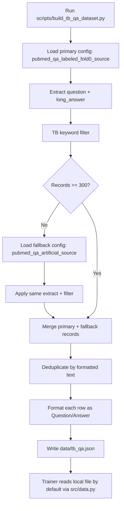

# Dataset Gathering — TB Clinical Q&A (Phase 1B)

This document is a reference note for how Phase 1B dataset assembly works.
It describes sources, filtering logic, output schema, and validation expectations.
For step-by-step execution commands, use `docs/runbook.md`.

## 1. What we need

A JSON file at `data/tb_qa.json` containing 500–2,000 records, each shaped as:

```json
{
  "question": "What is the standard first-line treatment for drug-sensitive tuberculosis?",
  "long_answer": "The standard first-line regimen for drug-sensitive TB ...",
  "formatted": "Question: ...\nAnswer: ..."
}
```

The `formatted` field is what the trainer actually tokenizes; the other two are kept for traceability and easier inspection.

## 2. Sources

### Primary — `bigbio/pubmed_qa` (HuggingFace)

A PubMed-derived Q&A dataset. Multiple configs exist; the most useful for our purpose are:

- `pubmed_qa_labeled_fold0_source` — ~1,000 expert-labeled Q&A pairs with long-form answers. Smaller but cleaner.
- `pubmed_qa_artificial_source` — ~211,000 automatically generated Q&A pairs from PubMed abstracts. Much larger, slightly noisier, and the right starting point if the labeled fold yields too few TB records after filtering.

### Fallback — `lavita/medical-qa-datasets`

A broader medical Q&A collection. Use this only if both PubMed QA configs yield fewer than 300 TB records after filtering. The format differs — check the schema before reusing the filter.

### Why not scrape PubMed directly?

We could call the NCBI E-utilities API and pull abstracts ourselves, but that adds rate-limiting concerns, requires API key management, and produces raw abstracts rather than Q&A pairs. PubMed QA does that conversion for us. Save the direct-scrape path for Phase 2+ if dataset size becomes a real bottleneck.

## 3. Setup

Runtime environment requirements:
- Python 3.10+
- Dependencies from `requirements.txt`
- Access to Hugging Face datasets (public access is sufficient)

(or `pip install` if you don't use `uv` — the Phase 1A repo uses `uv`, so match that convention)

A HuggingFace account is **not** required for these datasets — they are publicly accessible. If you do want auth (e.g. to avoid rate limits), run `huggingface-cli login` once.

## 4. The filter

A TB-relevant record contains at least one of these tokens (case-insensitive) in either `question` or `long_answer`:

```python
TB_KEYWORDS = [
    "tuberculosis",
    " TB ",            # leading and trailing space avoids matching "TBA", "STB", etc.
    "Mycobacterium",
    "MDR-TB",
    "XDR-TB",
    "isoniazid",
    "rifampicin",
    "pulmonary TB",
    "pyrazinamide",
    "ethambutol",
]
```

The space-padded `" TB "` is intentional. A naive `"TB"` substring match grabs words like "STBT", "PTBM", chemistry terms, and abbreviated patient IDs. The padded form misses TB at the very start or end of a sentence — acceptable, because such records nearly always also contain "tuberculosis" elsewhere in the long answer.

## 5. End-to-end script

Use the existing script `scripts/build_tb_qa_dataset.py`. Running it once produces `data/tb_qa.json`.

Dataset creation flow:



Execution command is documented in `docs/runbook.md` (Step 2.2).

Expected log output:

```
Loading pubmed_qa_labeled_fold0_source...
  → 67 TB-relevant records from primary config
Below threshold (300); pulling fallback pubmed_qa_artificial_source...
  → 1,432 TB-relevant records after fallback merge
  → 1,408 after dedup
Wrote data/tb_qa.json (1,408 records)
```

The exact count varies — anything between roughly 500 and 2,000 is fine.

## 6. Validation

Validation logic for the produced dataset:

This corresponds to **"Step 2.3 - Validate required fields and minimum size"** in `docs/runbook.md`.

Current automated checks verify:
- `data/tb_qa.json` exists
- JSON root is a list
- Record count is at least 300
- Every record includes `formatted`
- Every `formatted` value includes both `Question:` and `Answer:`

Note: median-length and sample-content checks are handled in the manual spot-check step (**SOP Step 2.4**).

## 7. Manual spot-check

Manual inspection criteria for sampled records:

- **Real TB content** — drug names, regimen durations, diagnostic terms. If half of the "TB" hits are actually about thyroid-binding globulin or some other unrelated abbreviation, tighten the keyword list (drop the bare `" TB "`, keep only spelled-out terms).
- **Reasonable answer length** — at least a couple of sentences. Single-sentence answers won't give the model enough generative signal.
- **English** — PubMed QA is English-only; if non-English text appears, it's a parsing bug.

This corresponds to **"Step 2.4 - Quick manual sample check (5 rows)"** in `docs/runbook.md`.

The sampling helper is `scripts/smoke_checks/2b_spot_check_dataset.py`; the run command is in `docs/runbook.md`.

## 8. What to do if yield is too low

If even after the fallback you have fewer than 300 records:

1. **Loosen the keyword list.** Add `BCG`, `latent TB`, `extrapulmonary`, `acid-fast bacilli`, `AFB smear`, `directly observed therapy`, `DOTS`.
2. **Drop the substring requirement on `long_answer` and require it on `question`** — flips the false-positive/false-negative tradeoff. Often increases yield because TB-related questions usually mention TB explicitly even when the answer paragraph doesn't.
3. **Switch fallback dataset** to `lavita/medical-qa-datasets`. The schema is different (`input` / `output` instead of `question` / `long_answer`) — adjust `extract_records` accordingly. Document the change in your run log.
4. **As a last resort, augment with a small synthetic batch.** Generate 200–300 TB Q&A pairs using a Claude prompt similar to Phase 1A's synthetic pipeline. Mark these clearly in the JSON (`"source": "synthetic"`) so they can be excluded from the held-out test split — the test set should only contain real PubMed records to keep evaluation honest.

## 9. Train / val / test split

The split is done in `src/data.py` at load time, not at build time. The `tb_qa.json` file is the single source of truth; splitting happens with a fixed seed inside the dataloader so it is reproducible across runs.

Target proportions:
- Train: 80% of the non-test set
- Validation: 20% of the non-test set
- Test: 50–100 records held out **before** the train/val split, never seen during training, used only for the prompt battery and base-vs-fine-tuned comparison

## 10. Caching and re-runs

`data/tb_qa.json` is the cached, processed dataset — commit-worthy if it fits in the repo (it should, at this size — a 2,000-record JSON is well under 10 MB). The HuggingFace `datasets` library will also cache the raw download under `~/.cache/huggingface/datasets/`. You can safely delete that cache; the build script will re-download the next time it runs.

If you change the keyword list, **delete `data/tb_qa.json` and rebuild** — otherwise the trainer keeps using the old filter results.

## 11. Licensing note

`bigbio/pubmed_qa` is derived from PubMed abstracts, which are public-domain in the United States but may carry usage restrictions in other jurisdictions for commercial redistribution. For Phase 1B (a learning artifact, no production use, no model release), we are well within fair use. If outputs of this project are ever published or commercialized, revisit licensing before redistributing the dataset itself.

---

*Once `data/tb_qa.json` is built and validated, the trainer in `run_training.py` can load it directly. No further data prep is needed.*
