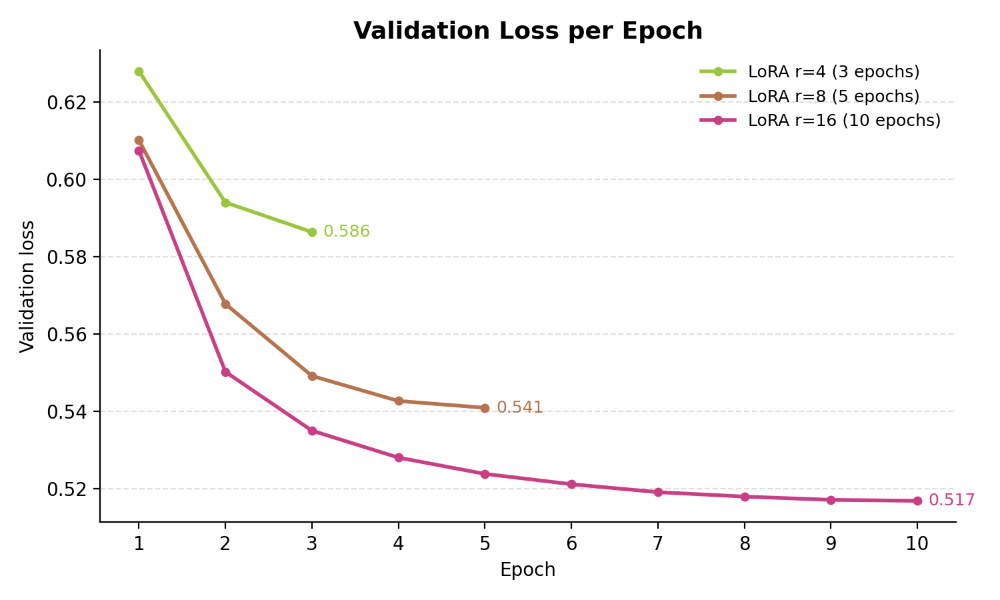
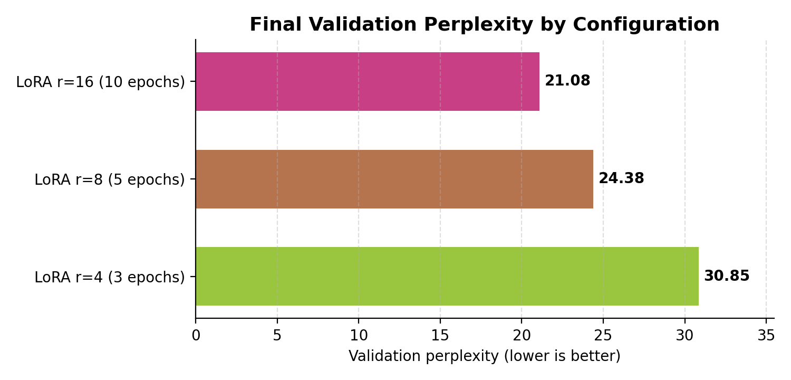

# Evaluation of Manual LoRA Adaptation on GPT-2 for PubMed-Based Tuberculosis Clinical Q&A Generation

## Authors and Affiliation

M. Arie Prasetyo¹*

1. PT Galenic Systems Indonesia, Bandung, Indonesia

*Correspondence: arie@galenic.systems

## Abstract

This study evaluates the effectiveness of a manually implemented Low-Rank Adaptation (LoRA) method for adapting GPT-2 to a generative tuberculosis (TB) clinical question-answering task. The dataset was built from the PubMedQA collection (`bigbio/pubmed_qa`) by filtering TB-related articles and formatting them as causal language modeling pairs in the "Question: ... Answer: ..." structure, yielding approximately 707 TB-related QA pairs. All base GPT-2 parameters were frozen, while LoRA parameters were injected into the `c_attn` attention projections and trained using a parameter-efficient fine-tuning approach. Experiments varied the LoRA rank (r = 4, 8, and 16) together with the number of training epochs (3, 5, and 10, respectively) to evaluate the effect of adapter capacity on domain adaptation. Quantitative evaluation used in-domain perplexity on the TB validation set and out-of-domain perplexity on WikiText-2 as an indicator of general-language retention. The results show that increasing the LoRA rank consistently reduces in-domain perplexity, from 30.85 at rank 4 to 24.38 at rank 8 and 21.08 at rank 16. In contrast, out-of-domain perplexity remained relatively stable in the 55–57 range, indicating that increased domain specialization was not accompanied by a significant change in the model's general-language capability. These findings show that a manual LoRA implementation can improve domain adaptation on GPT-2 with a relatively small number of trainable parameters, supporting the use of parameter-efficient fine-tuning as a foundation for developing larger biomedical language models for knowledge retrieval and health question-answering systems.

Keywords: LoRA, GPT-2, Tuberculosis, PubMedQA, Domain Adaptation, Parameter-Efficient Fine-Tuning

## 1. Introduction

Adapting language models to the medical domain requires parameter efficiency due to limited computational resources and the need for repeated experimentation. The LoRA approach enables fine-tuning by adding low-rank matrices without updating all of the base model's weights. In this study, a manual LoRA implementation previously used on a classification task is re-evaluated on a more challenging generative task: PubMed-literature-based TB clinical question answering.

Main contributions of this study:
1. Demonstrating an end-to-end manual LoRA pipeline for a clinical generative task on GPT-2.
2. Evaluating the impact of adaptation using both in-domain and out-of-domain metrics to monitor forgetting.
3. Analyzing the effect of LoRA rank on the trade-off between domain specificity and the stability of general-language capability.

## 2. Related Work

Briefly review:
1. Parameter-Efficient Fine-Tuning and LoRA.
2. Domain adaptation in medical NLP.
3. Evaluation of generative models based on perplexity and qualitative analysis.

Add citations according to the target journal's style.

## 3. Methods

### 3.1 Experimental Design

The study compares two conditions:
1. Base GPT-2 (without LoRA fine-tuning).
2. GPT-2 + trained LoRA adapter.

A rank ablation is conducted across the focused configurations r = 4, 8, and 16. In this ablation, the number of training epochs was scaled with rank (r4 = 3 epochs, r8 = 5 epochs, r16 = 10 epochs); the implications of this coupled design are discussed in the Limitations section.

### 3.2 Dataset

Primary source: `bigbio/pubmed_qa`.

Data steps:
1. Filter records using TB keywords, yielding approximately 707 TB-related QA pairs.
2. Format the data as "Question: ...\nAnswer: ...".
3. Store a local cache at `data/tb_qa.json`.
4. Split the data into train/validation/test according to the project pipeline.

### 3.3 Model and Training Configuration

1. Base model: GPT-2 (`GPT2LMHeadModel`, 124 million parameters).
2. All base model parameters are frozen before LoRA injection.
3. LoRA is injected into the fused QKV attention projection (`c_attn`) in each GPT-2 transformer block.

The LoRA mechanism decomposes the weight update $W_0 \in \mathbb{R}^{d \times k}$ as:

$$\Delta W = BA, \quad B \in \mathbb{R}^{d \times r},\quad A \in \mathbb{R}^{r \times k}, \quad r \ll \min(d,k)$$

so that the forward pass becomes:

$$h = W_0 x + \frac{\alpha}{r} \, BAx$$

Matrix $A$ is initialized with Kaiming uniform; matrix $B$ is initialized with zeros so that $\Delta W = 0$ at the start of training and the initial model behavior is preserved. In this study, $\alpha = r$ (coupled with the rank) so that the effective scale $\alpha/r = 1$ is consistent across all rank values in the ablation.

4. Core hyperparameters:
   - Optimizer: AdamW
   - Learning rate: $2 \times 10^{-4}$
   - Batch size: 4
   - Max sequence length: 512 tokens
   - Warmup: 10% of total training steps
   - Rank ablation (focused): $r \in \{4, 8, 16\}$ with epochs $\{3, 5, 10\}$ respectively, $\alpha = r$

### 3.4 Evaluation Protocol

Quantitative evaluation:
1. In-domain perplexity on the TB validation set.
2. Out-of-domain perplexity on WikiText-2 as a control for catastrophic forgetting.

Qualitative evaluation:
1. TB prompt battery (greedy and sampled decoding).
2. Side-by-side comparison before and after fine-tuning.

## 4. Results and Discussion

### 4.1 Quantitative Results

Table 1 presents the evaluation of the LoRA adapter across the focused rank configurations. As the rank increases, the number of trainable parameters grows linearly, from 147,456 parameters at rank 4 to 589,824 parameters at rank 16.

**Table 1.** In-domain and out-of-domain perplexity across LoRA rank configurations.

| Rank | Epochs | Trainable Parameters | Validation PPL | OOD PPL |
| ---- | ------ | -------------------: | -------------: | ------: |
| 4    | 3      |              147,456 |          30.85 |   55.81 |
| 8    | 5      |              294,912 |          24.38 |   56.78 |
| 16   | 10     |              589,824 |          21.08 |   56.71 |

The results show a consistent downward trend in in-domain perplexity as the LoRA rank increases. Compared to the rank-4 configuration, rank 16 yields a perplexity reduction of approximately 31.7%, indicating an improved ability of the model to model the distribution of the TB text used during training.

On the other hand, the out-of-domain perplexity values do not change significantly and stay within a narrow range (55–57). The stability of this metric indicates that the domain adaptation obtained through LoRA does not cause large degradation in GPT-2's general-language capability. This finding is consistent with the main goal of parameter-efficient fine-tuning, namely improving performance on the target domain without making large modifications to the base model parameters.

Furthermore, the validation loss curves (Figure 1) show a stable, monotonic decrease across all three configurations, with no indication of a rebound (overfitting). For the rank-16 configuration, validation loss dropped from approximately 0.607 at the start of training to 0.517 at the final epoch (step 9). The rank-8 and rank-4 configurations plateaued at higher values (≈0.540 and ≈0.586, respectively), consistent with their lower capacity and shorter training schedules. This suggests that the adapter capacity can still be exploited effectively at the dataset size used in this study.

**Figure 1.** Validation loss per epoch for the focused ablation runs `ablation_r4_e3`, `ablation_r8_e5`, and `ablation_r16_e10`. Final-epoch values are annotated (0.586, 0.541, 0.517). Source: Weights & Biases project `lora-phase-1b` (`val/loss`); underlying data in `outputs/wandb_charts/wandb_export_2026-06-09T23_09_42.866+07_00.csv`. Plot regenerated via `outputs/wandb_charts/make_figures.py`.

**Figure 2.** Final validation perplexity for each focused configuration (r16/e10 = 21.08, r8/e5 = 24.38, r4/e3 = 30.85; lower is better). Source: Weights & Biases project `lora-phase-1b` (`val/perplexity`); underlying data in `outputs/wandb_charts/wandb_export_2026-06-09T23_10_06.974+07_00.csv`. Plot regenerated via `outputs/wandb_charts/make_figures.py`.

### 4.2 Qualitative Results

Present 5–10 of the following TB prompts:
1. Base model output (greedy + sampled).
2. Best LoRA model output (greedy + sampled).
3. Analysis notes: clinical-term specificity, regimen completeness, hallucination potential.

### 4.3 Discussion

The results show that manual LoRA can adapt GPT-2 to the tuberculosis domain even though it uses only a small number of additional parameters. The consistent decrease in in-domain perplexity at higher ranks shows that the adapter successfully captured the linguistic patterns and terminology present in the TB corpus derived from PubMedQA.

Interestingly, the improvement in in-domain performance was not accompanied by a meaningful change in out-of-domain perplexity. This finding indicates that the base model's general knowledge is largely preserved, so that the risk of catastrophic forgetting in the tested configurations is relatively low. LoRA therefore provides an efficient adaptation mechanism for the medical domain without requiring a full update of all model parameters.

From a methodological standpoint, this study also shows that a manual LoRA implementation can produce behavior consistent with reports in the parameter-efficient fine-tuning literature. Despite using a relatively small GPT-2 (124 million parameters) and a dataset of approximately 707 question-answer pairs, the adapter was still able to produce measurable improvements on the domain validation metric.

The strongest scientific claim supported by these results is that manual LoRA adaptation improves in-domain modeling performance on TB-related QA data while maintaining relatively stable out-of-domain perplexity.

An important topic for further discussion is the preparation of a standardized inference server for human evaluation. In the context of this study, an inference server enables consistent A/B comparison between the base GPT-2 model and the best GPT-2 + LoRA adapter model using the same endpoint, decoding parameters, and logging. With this approach, evaluation does not rely solely on perplexity but can also incorporate answer-quality assessment by human raters (e.g., clinicians or biomedical researchers) in a more structured manner.

Beyond strengthening external validity, an inference-server design opens opportunities for cross-institutional collaboration. Collaborating partners can access a uniform evaluation interface for rubric-based annotation (terminology accuracy, regimen completeness, hallucination potential, and clinical usefulness), making cross-team results easier to compare and replicate.

## 5. Limitations

This study has several limitations:
1. The main evaluation is still dominated by automatic metrics (in-domain and out-of-domain perplexity), so it does not yet fully capture clinical factual quality.
2. In the reported ablation, **rank and the number of epochs were varied simultaneously** (r4 = 3 epochs, r8 = 5 epochs, r16 = 10 epochs). Consequently, the observed in-domain improvement cannot be attributed to rank alone, as it may partly stem from longer training. A controlled experiment that fixes the number of epochs across ranks is needed to disentangle these two factors.
3. No dedicated inference server is yet available to conduct controlled, blinded human evaluation between the base and LoRA models.
4. Inter-rater reliability has not been measured because the human evaluation protocol has not been run. If more than two raters are used, the appropriate metrics are Fleiss' kappa or Krippendorff's alpha, not Cohen's kappa.
5. The study is still small in scale with a single base architecture (GPT-2, 124M parameters), a modest dataset (~707 QA pairs), and a limited hyperparameter search space.
6. Training uses the entire token sequence as the loss target without question-token masking; this technique is planned for the next phase and may improve answer generation quality.

## 6. Conclusion

Manual LoRA proved viable as a domain-adaptation approach for a generative language model on the tuberculosis question-answering task. The rank-16 configuration provided the best performance in this experiment, with a validation perplexity of 21.08 and a validation loss of approximately 0.517. These results support the hypothesis that increasing adapter capacity can improve the model's domain capability without significantly sacrificing general-language ability, provided that model evaluation also considers out-of-domain metrics so that the risk of catastrophic forgetting remains monitored. Follow-up research should involve clinical-expert evaluation, additional evaluation metrics, comparison with standard PEFT implementations (e.g., HuggingFace PEFT), a controlled rank-vs-epoch ablation, and experiments on larger models.

## 7. Future Work

The next development plan focuses on building a research inference server to support methodologically stronger human evaluation:
1. Provide two standardized inference modes: base GPT-2 and GPT-2 + best LoRA adapter.
2. Run blinded A/B studies with the same TB prompts, fixed decoding parameters, and controlled seeds.
3. Develop an evaluation rubric together with clinical/academic partners (medical accuracy, specificity, readability, and hallucination risk).
4. Compute inter-rater reliability metrics (e.g., Fleiss' kappa or Krippendorff's alpha) to increase the credibility of results.
5. Build a human evaluation benchmark of 50–100 unseen TB questions comparing base GPT-2 against GPT-2 + LoRA r16, since in biomedical NLP reviewers generally find actual answer quality more compelling than perplexity alone.
6. Conduct a controlled ablation that fixes epochs across ranks to isolate the effect of rank.
7. Use the inference server as a multi-institution collaboration platform to broaden annotation coverage and external validation.

This approach is expected to strengthen the project's scientific contribution on the evaluation side while opening opportunities for formal collaboration with teaching hospitals, medical faculties, or health NLP laboratories.

## Acknowledgments

Example:
The author thanks [institution/lab/funder] for computational support and research discussion.

## Author Contributions

Use the CRediT format (example):
1. Conceptualization: A.M.P.
2. Methodology: A.M.P.
3. Software implementation: A.M.P.
4. Formal analysis: A.M.P.
5. Writing — original draft: A.M.P.
6. Review and editing: A.M.P.

> Add other authors and their contributions if collaborators join later.

## Ethics Statement

This study uses a public secondary dataset and does not involve intervention on human subjects. The model outputs are not intended for clinical use.

## Funding

Fill in one of the following:
1. This research received no specific funding.
2. This research was funded by [scheme name], contract number [xxx].

## Conflict of Interest

The author declares no conflict of interest.

## Data and Code Availability

1. Experiment code: this project's repository.
2. Processed dataset: `data/tb_qa.json` (subject to data distribution policy).
3. Result artifacts: `outputs/20260609-second-ablation-run_focused-ranks/results.csv`, `outputs/20260609-second-ablation-run_focused-ranks/checkpoints/`.

## References

Use the citation style required by the target journal (common in SINTA: APA 7, IEEE, or Vancouver).

Required references (verified):
1. Hu, E. J., Shen, Y., Wallis, P., Allen-Zhu, Z., Li, Y., Wang, S., Wang, L., & Chen, W. (2022). LoRA: Low-rank adaptation of large language models. In *International Conference on Learning Representations (ICLR)*.
2. Radford, A., Wu, J., Child, R., Luan, D., Amodei, D., & Sutskever, I. (2019). Language models are unsupervised multitask learners. *OpenAI Blog*, 1(8). [Primary GPT-2 reference]
3. Jin, Q., Dhingra, B., Liu, Z., Cohen, W. W., & Lu, X. (2019). PubMedQA: A dataset for biomedical research question answering. In *Proceedings of EMNLP-IJCNLP*. [PubMed QA dataset reference]
4. Fries, J. A., et al. (2022). BigBio: A framework for data-centric biomedical natural language processing. In *Advances in Neural Information Processing Systems (NeurIPS)*. [Reference for HuggingFace bigbio/pubmed_qa]
5. Loshchilov, I., & Hutter, F. (2019). Decoupled weight decay regularization. In *ICLR*. [AdamW reference]
6. Merity, S., Xiong, C., Bradbury, J., & Socher, R. (2017). Pointer sentinel mixture models. In *ICLR*. [WikiText-2 reference]

References to be added:
- [Add a reference on domain adaptation in medical NLP]
- [Add a reference on catastrophic forgetting in LMs]
- [Add a comparative PEFT reference, e.g., Lester et al. 2021 (prompt tuning), Houlsby et al. 2019 (adapter)]
- [Add inter-rater evaluation references (Fleiss 1971, Krippendorff 2004) if the human eval study proceeds]

## Appendix (Optional)

1. Full prompt battery.
2. Per-seed results table.
3. Environment details (GPU, library versions, commit hash).
